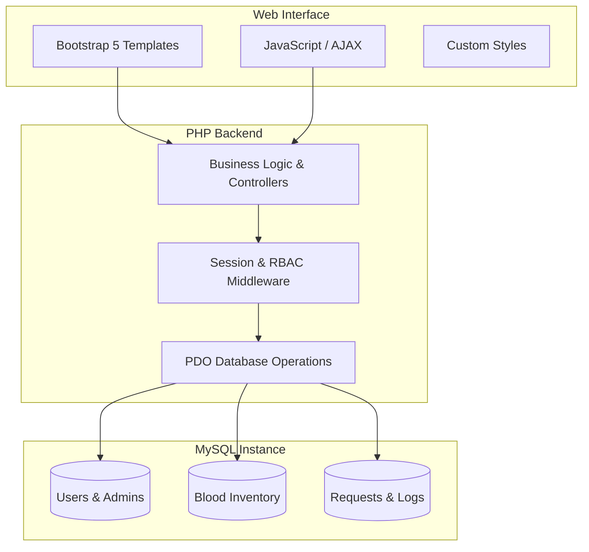

# 🩸 Blood Banking Management System (BBMS)

[](https://www.php.net/)
[](https://www.mysql.com/)
[](https://getbootstrap.com/)
[](LICENSE)

---

## 🏗️ Project Overview

The **Blood Banking Management System (BBMS)** is an advanced web-based solution engineered to modernize traditional blood bank operations. By automating donor registration, inventory tracking, and blood request fulfillment, the system ensures that critical medical resources are managed with surgical precision and accessible when every second counts. 

### 🎯 Core Objectives
*   **Empower Donors**: Providing a seamless platform for individuals to contribute to the global blood supply.
*   **Intelligent Inventory**: Real-time management of blood units with automated stock synchronization.
*   **Operational Excellence**: Streamlining administrative tasks through a centralized governance dashboard.

---

## 🌟 Key Features

### 👤 User & Donor Experience
*   **Secure Onboarding**: Multi-step registration with role-based access control (Admin vs. User).
*   **Personalized Dashboard**: Track donation history, view impact statistics, and manage profile details.
*   **Donation Intent**: Submit medical history and donation applications with file upload support for medical proof.
*   **Blood Requests**: Effortless submission of emergency blood requests with urgency levels (Low to Critical).
*   **Notification System**: Real-time updates on application status, request approvals, and critical alerts.

### 🛡️ Administrative Command Center
*   **Centralized Oversight**: Manage user accounts, donor applications, and blood requests from a single interface.
*   **Inventory Control**: Granular tracking of blood units across all 8 major blood groups (A±, B±, AB±, O±).
*   **Automated Workflow**: Approval-driven stock updates—approving a donation automatically increments inventory.
*   **Reporting & Analytics**: Insightful data visualizations and activity logs for informed decision-making.

---

## 🛠️ Technology Stack

| Component | Technology | Role |
| :--- | :--- | :--- |
| **Backend** | PHP (PDO) | Core business logic and secure data processing. |
| **Database** | MySQL | Robust, relational data storage with optimized indexing. |
| **Frontend UI** | Bootstrap 5 | Modern, responsive framework for cross-device compatibility. |
| **Aesthetics** | Vanilla CSS | Custom "Blood Red" themed UI components and animations. |
| **Icons** | FontAwesome 6 | Professional vector icons for enhanced UX. |
| **Typography** | Inter (Google Fonts) | Clean, legible sans-serif for medical professional context. |

---

## 🏗️ System Architecture

The project follows a modern **three-tier architecture** to ensure scalability, maintainability, and security:



### 📂 Directory Structure

```bash
BBMS/
├── admin/          # Advanced Administrative Suite & Dashboard
├── auth/           # Secure Authentication (Login, Register, Logout)
├── donor/          # Dedicated Donor Portal & Application Logic
├── includes/       # Core Engine: DB Connections, Global Functions, Shared Templates
├── assets/         # Design System: CSS, JavaScript, and Media Assets
├── database/       # SQL Schema & Persistence Layer
├── uploads/        # Encrypted Storage for Medical Proofs & Documents
└── index.php       # High-Engagement Landing Page
```

---

## 🚀 Quick Setup Guide

### 1. Prerequisites
*   **Web Server**: XAMPP, WAMP, or any environment running PHP 7.4+.
*   **Database**: MySQL/MariaDB 5.7+ or 8.0+.

### 2. Installation Steps
1.  **Clone/Download**: Extract the `BBMS` repository into your server's root directory (e.g., `htdocs`).
2.  **Database Configuration**:
    *   Access PHPMyAdmin and create a database named `bdms`.
    *   Import the SQL file located at `database/bdms.sql`.
3.  **Environment Setup**:
    *   Open `includes/config.php` and update the database credentials to match your local environment.
4.  **Launch**: Navigate to `http://localhost/BBMS/` in your web browser.

---

## 🔒 Security Implementation
*   **SQLi Prevention**: 100% integration of **PDO Prepared Statements** for all database interactions.
*   **Password Security**: Industry-standard **BCRYPT** hashing for all user credentials.
*   **Access Control**: Robust middleware ensuring role-based permissions and session integrity.
*   **Data Integrity**: Cascading deletes and foreign key constraints to maintain a clean database state.

---

## 📜 Credits & Contributors

Developed with a focus on impact and professional software engineering standards.

*   **Principal Developer**: Mohamed Dahir (System Architecture, Logic & UI/UX Design)
*   **Project Visionary**: [Ahmed Abdiqadir](https://github.com/ahmettac723-ai) (Domain Expert & Requirements Gathering)

---

<div align="center">
  <p>© 2026 <strong>BBMS</strong> - Bridging Hearts through Technology</p>
</div>
